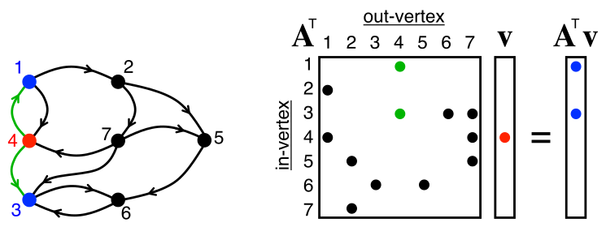

 
# pygraphblas

pygraphblas is a Python wrapper around the
[GraphBLAS](http://graphblas.org) API.

## [Click here for API Documentation](https://graphegon.github.io/pygraphblas/pygraphblas/index.html)

## Installation

pygraphblas requires the
[SuiteSparse:GraphBLAS](http://faculty.cse.tamu.edu/davis/GraphBLAS.html)
library.  Once you have these installed, pygraphblas can be installed
with:

  python setup.py install
  
There are two ways to download precompiled binaries of pygraphblas
with SuiteSparse included.  One way is to use `pip install
pygraphblas` on an Intel Linux machine.  This will download a package
compatible with most modern linux distributions.  This also works in a
Docker container on Mac.

There are also pre-build docker images based on Ubuntu 20.04 that have
a pre-compiled SuiteSparse and pygraphblas installed.  These come in
two flavors `minimal` which is the Ipython interpreter-only, and
`notebook` which comes with a complete Jupyter Notebook server.  These
containers also work on Mac.

An installation script for Ubuntu 18.04 is provided in the
`install-ubuntu.sh` file.

NOTE: DO NOT USE THESE PRE-COMPILED BINARIES FOR BENCHMARKING
SUITESPARSE.  These binaries are not guaranteed to be idealy compiled
for your environment.  You must build your own binaries on your own
platforms if you intend to do ANY valid benchmarking.

## Docker 

pygraphblas is distributed as two different docker images on [Docker
Hub](https://cloud.docker.com/repository/docker/pygraphblas/pygraphblas/general)
.  The "minimal" image, containing only the library and
[ipython](https://ipython.org/) and can be run with the command:

    docker run --rm -it graphblas/pygraphblas-minimal ipython

You can run a "full" [Jupyter notebook](https://jupyter.org/) server
with docker and try the example Notebooks use the command:

    docker run --rm -it -p 8888:8888 graphblas/pygraphblas-notebook

Open up the URL printed on your terminal screen to see the demo
Notebook folder, including:

 - [Introduction to GraphBLAS with Python](./demo/Introduction-to-GraphBLAS-with-Python.ipynb)
 - [PageRank](./demo/PageRank.ipynb)
 - [Betweeness Centrality](./demo/BetweenessCentrality.ipynb)
 - [Triangle Centrality](./demo/TriangleCentrality.ipynb)
 - [Gallery of Centrality](./demo/Centrality.ipynb)
 - [K-Truss Subgraphs](./demo/K-Truss.ipynb)
 - [Triangle Counting](./demo/Triangle-Counting.ipynb)
 - [Louvain Community Detection](./demo/Louvain.ipynb)
 - [RadiX-Net Topologies](./demo/RadiX-Net-with-pygraphblas.ipynb)
 - [User Defined Types](./demo/User-Defined-Types.ipynb)
 - [Log Semiring Type](./demo/Log-Semiring.ipynb)

# Tests

To run the tests checkout pygraphblas and use:

    $ ./test.sh

# Summary

pygraphblas is a python extension that bridges [The GraphBLAS
API](http://graphblas.org) with the [Python](https://python.org)
programming language.  It uses the
[CFFI](https://cffi.readthedocs.io/en/latest/) library to wrap the low
level GraphBLAS API and provides high level Matrix and Vector Python
types that make GraphBLAS simple and easy.

GraphBLAS is a sparse linear algebra API optimized for processing
graphs encoded as sparse matrices and vectors.  In addition to common
real/integer matrix algebra operations, GraphBLAS supports over a
thousand different [Semiring](https://en.wikipedia.org/wiki/Semiring)
algebra operations, that can be used as basic building blocks to
implement a wide variety of graph algorithms. See
[Applications](https://en.wikipedia.org/wiki/Semiring#Applications)
from Wikipedia for some specific examples.

pygraphblas leverages the expertise in the field of sparse matrix
programming by [The GraphBLAS Forum](http://graphblas.org) and uses
the
[SuiteSparse:GraphBLAS](http://faculty.cse.tamu.edu/davis/GraphBLAS.html)
API implementation. SuiteSparse:GraphBLAS is brought to us by the work
of [Dr. Tim Davis](http://faculty.cse.tamu.edu/davis/welcome.html),
professor in the Department of Computer Science and Engineering at
Texas A&M University.  [News and
information](http://faculty.cse.tamu.edu/davis/news.html) can provide
you with a lot more background information, in addition to the
references below.

While it is my goal to make it so that pygraphblas works with any
GraphBLAS implementation, it currently only works with SuiteSparse.
SuiteSparse is currently the only realistically usable GraphBLAS
implementation, and additionally it provides several "extension"
features and pre-packaged objects that are very useful for
pygraphblas.  If there is a GraphBLAS implementation you would like to
see support for in pygraphblas, please consider creating an issue for
it for discussion and/or sending me a pull request.

# Introduction to Graphs and Matrices

GraphBLAS uses matrices and Linear Algebra to represent graphs, as
described [in this mathmatical introduction to
GraphBLAS](http://www.mit.edu/~kepner/GraphBLAS/GraphBLAS-Math-release.pdf)
by [Dr. Jeremy Kepner](http://www.mit.edu/~kepner/) head and founder
of [MIT Lincoln Laboratory Supercomputing
Center](http://news.mit.edu/2016/lincoln-laboratory-establishes-supercomputing-center-0511).

There are two useful matrix representations of graphs: [Adjacency
Matrices](https://en.wikipedia.org/wiki/Adjacency_matrix) and
[Incidence Matrices](https://en.wikipedia.org/wiki/Incidence_matrix).
For this introduction we will focus on the adjacency type as they are
simpler, but the same ideas apply to both, both are suported by
GraphBLAS and pygraphblas, and it is easy to switch back and forth
between them.

On the left is a graph, and on the right, the adjacency matrix that
represents it. The matrix has a row and column for every node in the
graph.  If there is an edge going from node A to B, then there will be
a value present in the intersection of As row with Bs column.  How it
differs from many other matrix representations is that the matrix is
sparse, nothing is stored in computer memory where there are unused
elements.

Sparsity is important because one practical problem with
matrix-encoding graphs is that most real-world graphs tend to be
sparse, as above, only 7 of 36 possible elements have a value. Those
that have values tend to be scattered randomly across the matrix
(for "typical" graphs), so dense linear algebra libraries like BLAS or
numpy do not encode or operate on them efficiently, as the relevant
data is mostly empty memory with actual data elements spaced far
apart.  This wastes memory and CPU resources, and defeats CPU caching
mechanisms.

For example, suppose a fictional social network has 1 billion users,
and each user has about 100 friends, which means there are about 100
billion (1e+11) connections in the graph.  A dense matrix large enough
to hold this graph would need (1 billion)^2 or
(1,000,000,000,000,000,000), a "quintillion" elements, but only 1e+11
of them would have meaningful values, leaving only 0.0000001th of the
matrix being utilized.

By using a sparse matrix instead of dense, only the elements used are
actually stored in memory. The parts of the matrix with no value are
*interpreted*, but not necessarily stored, as an identity value, which
may or may not be the actual number zero, but possibly other values
like positive or negative infinity depending on the particular
semiring operations applied to the matrix.

Semirings encapsulate different algebraic operations and identities
that can be used to multiply matrices and vectors.  Anyone who has
multiplied matrices has used at least one Semiring before, typically
referred to as "plus_times".  This is the common operation of
multiplying two matrices containing real numbers, the corresponding row
and column entries are multipled and the results are summed for the
final value.

## Code of Conduct

Everyone interacting in the pygraphblas project's codebases, issue
trackers, chat rooms, and mailing lists is expected to follow the [PSF
Code of Conduct](https://www.python.org/psf/conduct/).
