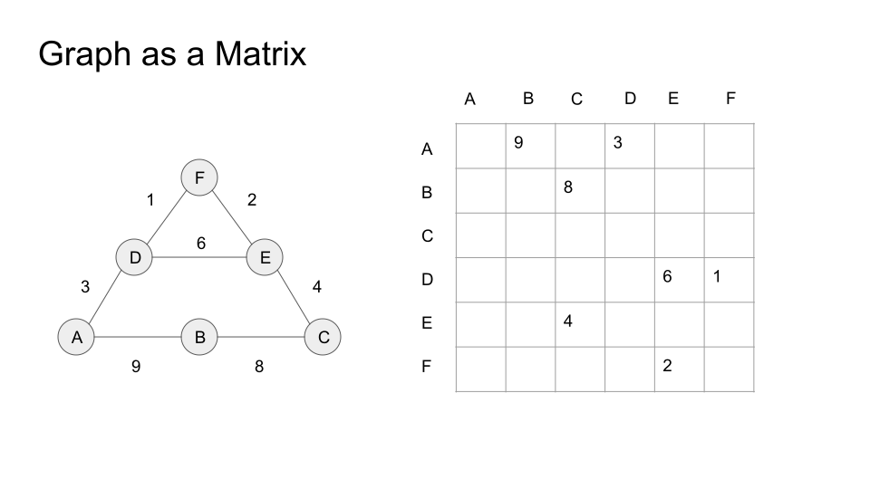

 
# pygraphblas

pygraphblas is a Python wrapper around the
[GraphBLAS](http://graphblas.org) API.

## Installation

pygraphblas requires
[SuiteSparse:GraphBLAS](http://faculty.cse.tamu.edu/davis/GraphBLAS.html)
and the [LAGraph](https://github.com/GraphBLAS/LAGraph) library.  Once
you have these installed, pygraphblas can be installed with:

  python setup.py install

## Docker 

pygraphblas is distributed as a docker image on [Docker
Hub](https://cloud.docker.com/repository/docker/pygraphblas/pygraphblas/general)
and can be run with the command:

    docker run -it graphblas/pygraphblas-notebook ipython

## Tutorial

You can run a Jupyter notebook server with docker and try the example
Notebooks:

    ./notebook.sh

Open up the URL `http://127.0.0.1:8888/tree/pygraphblas/demo` and see
the following Notebooks:

 - [Introduction to GraphBLAS with Python](./pygraphblas/demo/Introduction-to-GraphBLAS-with-Python.ipynb)
 - [PageRank](./pygraphblas/demo/PageRank.ipynb)
 - [Betweeness Centrality](./pygraphblas/demo/BetweenessCentrality.ipynb)
 - [K-Truss Subgraphs](./pygraphblas/demo/K-Truss.ipynb)
 - [Triangle Counting](./pygraphblas/demo/Triangle-Counting.ipynb)
 - [RadiX-Net Topologies](./pygraphblas/demo/RadiX-Net-with-pygraphblas.ipynb)
 - [User Defined Types](./pygraphblas/demo/User-Defined-Types.ipynb)

# Tests

Next run the tests:

    $ docker run -it pygraphblas/pygraphblas pytest
    ========================================== test session starts ==========================================
    platform linux -- Python 3.7.3, pytest-5.0.1, py-1.8.0, pluggy-0.12.0
    rootdir: /pygraphblas, inifile: setup.cfg
    plugins: cov-2.7.1
    collected 54 items

    tests/test_demo.py .                                                                              [  1%]
    tests/test_matrix.py ...............................                                              [ 59%]
    tests/test_scalar.py ....                                                                         [ 66%]
    tests/test_vector.py ..................                                                           [100%]

    ======================================= 54 passed in 1.04 seconds =======================================

# Summary

pygraphblas is a python extension that bridges [The GraphBLAS
API](http://graphblas.org) with the [Python](https://python.org)
programming language using the
[CFFI](https://cffi.readthedocs.io/en/latest/) library to wrap the low
level GraphBLAS API and provide high level Matrix and Vector Python
types.

GraphBLAS is a sparse linear algebra API optimized for processing
graphs encoded as sparse matrices and vectors.  In addition to common
real/integer matrix algebra operations, GraphBLAS supports up to 960
different [Semiring](https://en.wikipedia.org/wiki/Semiring) algebra
operations, that can be used as basic building blocks to implement a
wide variety of graph algorithms. See
[Applications](https://en.wikipedia.org/wiki/Semiring#Applications)
from Wikipedia for some specific examples.

pygraphblas leverages the expertise in the field of sparse matrix
programming by [The GraphBLAS Forum](http://graphblas.org) and uses
the
[SuiteSparse:GraphBLAS](http://faculty.cse.tamu.edu/davis/GraphBLAS.html)
API implementation. SuiteSparse:GraphBLAS is brought to us by the work
of [Dr. Tim Davis](http://faculty.cse.tamu.edu/davis/welcome.html),
professor in the Department of Computer Science and Engineering at
Texas A&M University.  [News and
information](http://faculty.cse.tamu.edu/davis/news.html) can provide
you with a lot more background information, in addition to the
references below.

While it is my goal to make it so that pygraphblas works with any
GraphBLAS implementation, it currently only works with SuiteSparse
v3.1.0.  SuiteSparse provides several "extension" features and
pre-packaged objects that are very useful for pygraphblas.  If there
is a GraphBLAS implementation you would like to see support for in
pygraphblas, please consider sending me a pull request.

# Intro

Matrices can be used as powerful representations of graphs, as
described [in this mathmatical introduction to
GraphBLAS](http://www.mit.edu/~kepner/GraphBLAS/GraphBLAS-Math-release.pdf)
by [Dr. Jermey Kepner](http://www.mit.edu/~kepner/) head and founder
of [MIT Lincoln Laboratory Supercomputing
Center](http://news.mit.edu/2016/lincoln-laboratory-establishes-supercomputing-center-0511).

There are two useful matrix representations of graphs: [Adjacency
Matrices](https://en.wikipedia.org/wiki/Adjacency_matrix) and
[Incidence Matrices](https://en.wikipedia.org/wiki/Incidence_matrix).
For this introduction we will focus on the adjacency type as they are
simpler, but the same ideas apply to both, both are suported by
GraphBLAS and pygraphblas, and it is easy to switch back and forth
between them.

On the left is a graph, and on the right, the adjacency matrix that
represents it. The matrix has a row and column for every node in the
graph.  If there is an edge going from node A to B, then there will be
a value present in the intersection of As row with Bs column.  How it
differs from many other matrix representations is that the matrix is
sparse, nothing is stored in computer memory where there are unused
elements.

Sparsity is important because one practical problem with
matrix-encoding graphs is that most real-world graphs tend to be
sparse, as above, only 7 of 36 possible elements have a value. Those
that have values tend to be scattered randomly across the matrix
(for "typical" graphs), so dense linear algebra libraries like BLAS or
numpy do not encode or operate on them efficiently, as the relevant
data is mostly empty memory with actual data elements spaced far
apart.  This wastes memory and CPU resources, and defeats CPU caching
mechanisms.

For example, suppose a fictional social network has 1 billion users,
and each user has about 100 friends, which means there are about 100
billion (1e+11) connections in the graph.  A dense matrix large enough
to hold this graph would need (1 billion)^2 or
(1,000,000,000,000,000,000), a "quintillion" elements, but only 1e+11
of them would have meaningful values, leaving only 0.0000001th of the
matrix being utilized.

By using a sparse matrix instead of dense, only the elements used are
actually stored in memory. The parts of the matrix with no value are
*interpreted*, but not necessarily stored, as an "identity" value,
which may or may not be the actual number zero, but possibly other
values like positive or negative infinity depending on the particular
semiring operations applied to the matrix.

Semirings encapsulate different algebraic operations and identities
that can be used to multiply matrices and vectors.  Anyone who has
multiplied matrices has used at least one Semiring before, typically
referred to as "plus_times".  This is the common operation of
multiplying two matrices containing real numbers, the corresponding row
and column entries are multipled and the results are summed for the
final value.

When using matrices to solve graph problems, it's useful to have a
wide variety of semirings that replace the multplication and addition
operators and identities with other operations and values.  For
example, finding a shortest path between nodes involves substituting
the `min()` function for the add operation, and the plus function for
the times.  pygraphblas wraps all 960 distinct built-in semirings that
come with the SuiteSparse GraphBLAS implementation.

Semirings can also work over different domains than just numbers,
however pygraphblas does not support the GraphBLAS user defined types
(UDT) integration yet.  This is being actively worked on.

# Solving Graph Problems with Semirings

Once encoded as matrices, graph problems can be solved be using matrix
multiplication over a variety of semrings.  For numerical problems,
matrix multiplication with libraries and languages like BLAS, MATLAB
and numpy is done with real numbers using the arithmetic plus and
times semiring.  GraphBLAS can do this as well, of course, but it also
abstracts out the numerical type and operators that can be used for
"matrix multiplication".

# API

Coming soon, real API docs.

The pygraphblas package contains the following sub-modules:

- `pygrablas.matrix` contains the Matrix type

- `pygrablas.vector` contains the Vector type

- `pygrablas.descriptor` contains descriptor types

- `pygrablas.semiring` contains Semiring types

- `pygrablas.binaryop` contains BinaryOp types

- `pygrablas.unaryop` contains UnaryOp types

- `pygrablas.base` contains low-level API and FFI wrappers.

Full API documentation coming soon, for now, check out the complete
tests for usage.

# TODO

- User Defined Types

- Push for 100% coverage.

- A lot more documentation.

- ReadTheDocs site.

- User defined types.

- optimize construction from numpy.array and scipy.sparse
