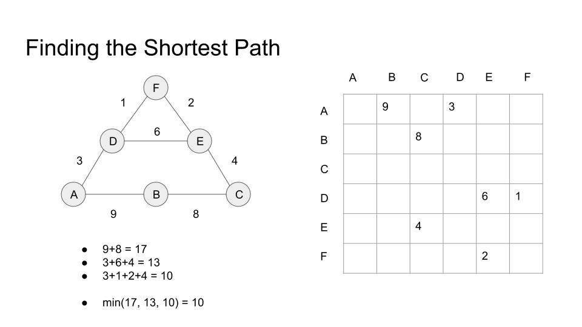
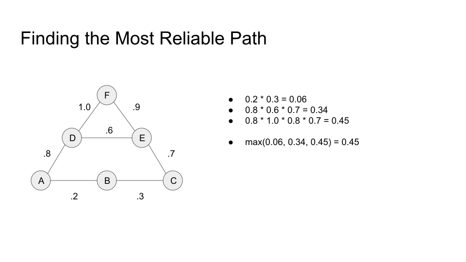

# pygraphblas

SuitSparse:GraphBLAS for Python

# Install

pygraphblas for now involves building packages from source and
requires Python 3.7 or higher.  For simple setup, a Dockerfile is
provided that builds a complete pygraphblas environment based on the
[Jupyer Base Notebook
image](https://hub.docker.com/r/jupyter/base-notebook/).  To build a
new container, run:

	docker build . -t pygraphblas

This will tag the new container as `pygraphblas`.  Change that if you
want.  Next run the tests:

	$ docker run -it pygraphblas pytest
	============================= test session starts ==============================
	platform linux -- Python 3.7.3, pytest-5.0.1, py-1.8.0, pluggy-0.12.0
	rootdir: /pygraphblas, inifile: setup.cfg
	collected 47 items

	tests/test_matrix.py .............................                       [ 61%]
	tests/test_vector.py ..................                                  [100%]

	========================== 47 passed in 0.36 seconds ===========================

This means pyhgraphblas is ready to go.  An interactive ipython
session can be run to play with it:

	$ docker run -it pygraphblas ipython
	Python 3.7.3 | packaged by conda-forge | (default, Jul  1 2019, 21:52:21)
	Type 'copyright', 'credits' or 'license' for more information
	IPython 7.6.1 -- An enhanced Interactive Python. Type '?' for help.

	In [1]: from pygraphblas import Matrix
	
	# two random 3x3 matrices with 3 random values mod(10)

	In [3]: m = Matrix.from_random(int, 3, 3, 3).apply(lambda x: mod(x, 10))

	In [4]: n = Matrix.from_random(int, 3, 3, 3).apply(lambda x: mod(x, 10))

	In [5]: n @= m  # multiply accumulate

	In [8]: n
	Out[8]: <Matrix (3x3: 2)>

	In [6]: n.to_lists()
	Out[6]: [[0, 1], [0, 0], [0, 35]] # only two values in sparse 3x3

# Summary

pygraphblas is a python extension that bridges [The GraphBLAS
API](http://graphblas.org) with the [Python](https://python.org)
programming language using the
[CFFI](https://cffi.readthedocs.io/en/latest/) library to wrap the low
level GraphBLAS API and provide high level Matrix and Vector types are
normal Python classes.

GraphBLAS is a sparse linear algebra API optimized for processing
graphs encoded as sparse matrices and vectors.  In addition to common
real/integer matrix algebra operations, GraphBLAS supports up to 960
different [Semiring](https://en.wikipedia.org/wiki/Semiring) algebra
operations, that can be used as basic building blocks to implement a
wide variety of graph algorithms. See
[Applications](https://en.wikipedia.org/wiki/Semiring#Applications)
from Wikipedia for some specific examples.

pygraphblas leverages the expertise in the field of sparse matrix
programming by [The GraphBLAS Forum](http://graphblas.org) and uses
the
[SuiteSparse:GraphBLAS](http://faculty.cse.tamu.edu/davis/GraphBLAS.html)
API implementation. SuiteSparse:GraphBLAS is brought to us by the work
of [Dr. Tim Davis](http://faculty.cse.tamu.edu/davis/welcome.html),
professor in the Department of Computer Science and Engineering at
Texas A&M University.  [News and
information](http://faculty.cse.tamu.edu/davis/news.html) can provide
you with a lot more background information, in addition to the
references below.

pygraphblas uses the excellent
[CFFI](https://cffi.readthedocs.io/en/latest/) library and is tested
with CPython 3.7+.  CPython 2 will not be supported.

# Intro

Matrices can be used as powerful representations of graphs, as
described [in this mathmatical introduction to
GraphBLAS](http://www.mit.edu/~kepner/GraphBLAS/GraphBLAS-Math-release.pdf)
by [Dr. Jermey Kepner](http://www.mit.edu/~kepner/) head and founder
of [MIT Lincoln Laboratory Supercomputing
Center](http://news.mit.edu/2016/lincoln-laboratory-establishes-supercomputing-center-0511).

There are two useful matrix representations of graphs: [Adjacency
Matrices](https://en.wikipedia.org/wiki/Adjacency_matrix) and
[Incidence Matrices](https://en.wikipedia.org/wiki/Incidence_matrix).
For this introduction we will focus on the adjacency type as they are
simpler, but the same ideas apply to both, both are suported by
GraphBLAS and pygraphblas, and it is easy to switch back and forth
between them.

On the left is a graph, and on the right, the adjacency matrix that
represents it. The matrix has a row and column for every node in the
graph.  If there is an edge going from node A to B, then there will be
a value present in the intersection of As row with Bs column.  How it
differs from many other matrix representations is that the matrix is
sparse, nothing is stored in computer memory where there are "empty"
spaces.

This is because one practical problem with matrix-encoding graphs is
that most real-world graphs tend to be sparse, as above, only 7 of 36
possible elements have a value. Those that have values tend to be
scattered uniformally across the matrix (for "typical" graphs), so
dense linear algebra libraries like BLAS or numpy do not encode or
operate on them efficiently, as the relevant data is mostly empty
memory with actual data elements spaced far apart.  This wastes memory
and cpu resources, and defeats CPU caching mechanisms.

For example, suppose a fictional social network has 1 billion users,
and each user has about 100 friends, which means there are about 100
billion (1e+11) connections in the graph.  A dense matrix large enough
to hold this graph would need (1 billion)^2 or
(1,000,000,000,000,000,000), a "quintillion" elements, but only 1e+11
of them would have meaningful values, leaving only 0.0000001th of the
matrix being utilized.

By using a sparse matrix instead of dense, only the elements used are
actually stored in memory. The parts of the matrix with no value are
*interpreted*, but not necessarily stored, as an "algebraic zero"
value, which may or may not be the actual number zero, but possibly
other values like positive or negative infinity depending on the
particular semiring operations applied to the matrix.

Semirings ecapsulate different algebraic operations and identities
that can be used to multiply matrices and vectors.  Anyone who has
multiplied matrices has used at least one Semiring before, typically
referred to as "plus_times".  This is the common operation of
multiplying two matrices containing real numbers, the coresponding row
and column entries are multipled and the results are summed for the
final value.

When using matrices to solve graph problems, it's useful to have a
wide variety of semirings that replace the multplication and addition
operators with other operations.  For example, finding a shorest path
between nodes involves substituting the `min()` function for the add
operation, and the plus function for the times.  pygraphblas wraps all
960 distinct built-in semirings that come with the SuiteSparse
GraphBLAS implementation.

Semirings can also work over different domains than just numbers,
however pygraphblas does not support the GraphBLAS user defined types
(UDT) integration yet.  This is being actively worked on.

# Solving Graph Problems with Semirings

Once encoded as matrices, graph problems can be solved be using matrix
multiplication over a variety of semrings.  For numerical problems,
matrix multiplication with libraries and languages like BLAS, MATLAB
and numpy is done with real numbers using the arithmetic plus and
times semiring.  GraphBLAS can do this as well, of course, but it also
abstracts out the numerical type and operators that can be used for
"matrix multiplication".

For example, let's consider three different graph problems and the
semrings that can solve them.  The first is finding the shortest path
between nodes in a graph.

In this example, the nodes can be cites, the the edge weights
distances between the cities in units like kilometers.  If travelling
from city A to city C, how can we compute the shortest path to take?
The process is fairly simple, add the weights along each path, and
then use the minimum function to find the shortest distance.

In pygraphblas, the semiring that solves this problem is called
`pygraphblas.semiring.min_plus_int`.  There are two different styles
for writing this with pygraphblas, one is to use `with` blocks to
specify the operations to be used, and then use standard Python matrix
multiplication syntax:

	from pygraphblas import Matrix, Vector
	from pygraphblas.semiring import min_plus_int64
	from pygraphblas.binaryop import min_int64, Accum
	
	def sssp(matrix, start):
		v = Vector.from_type(            # create a vector 
			matrix.gb_type,              # same type as m
			matrix.nrows                 # same size as rows of m
		)
		v[start] = 0                     # set the starting vertext distance

		with min_plus_int64, Accum(min_int64): # set Semiring, Accumulator
			for _ in range(matrix.nrows):      # for every row in m
				w = Vector.dup(v)              # dup the vector
				v @= matrix                    # multiply accumulate
				if w == v:                     # if nothing changed
					break                      # exit early
			return v
			
An identical but slightly more verbose approach is to call the
multiplication method directly `Vector.vxm' in this case, with
explicit semiring and accumulator operations:

	def sssp_direct(matrix, start):
		v = Vector.from_type(            # create a vector 
			matrix.gb_type,              # same type as m
			matrix.nrows                 # same size as rows of m
		)
		v[start] = 0                     # set the starting vertext distance

		for _ in range(matrix.nrows):    # for every row in m:
			w = Vector.dup(v)            # dup the vector
			v.vxm(                       # multiply vector by matrix 
				matrix, out=v,
				semiring=min_plus_int64, # with min_plus, 
				accum=min_int64          # acccumulate the minimum
			)
			if w == v:                   # if nothing changed
				break                    # exit early
		return v

For the next example, lets take a problem that at first seems quite
different, but can be solved in a similarly with a different semiring.
In this case, we have a network of computer nodes, and the edge
weights are the reliablity of the links between them as a percentage
of success.

How to we solve which path is the most reliable from A to C?  Like the
previous example, we operate along each path, but instead of adding
distances, probablity theory tells us that consecutive events must be
multiplied.  And instead of finding the minimum distance, we use the
max() function to find the path with maximum reliability.

In pygraphblas, the semiring that solves this problem is called
`pygraphblas.semiring.max_times_float`.

# API

The pygraphblas package contains the following sub-modules:

- `pygrablas.matrix` contains the Matrix type

- `pygrablas.vector` contains the Vector type

- `pygrablas.descriptor` contains descriptor types

- `pygrablas.semiring` contains Semiring types

- `pygrablas.binaryop` contains BinaryOp types

- `pygrablas.base` contains low-level API and FFI wrappers.

Full API documentation coming soon, for now, check out the complete
tests for usage.

# TODO

- ReadTheDocs site.

- Jupyter Notebook tutorial.

- Construction from numpy.array and scipy.sparse
